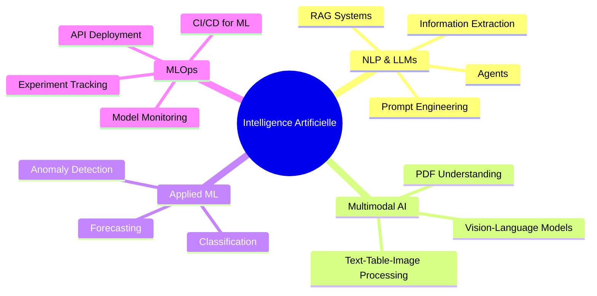

 **Salut, je suis Ahmed Amine Jadi**

<div align="center">
  
</div>

<div align="center">

## AI Engineering | Data & MLOps | Applied Machine Learning

[](https://www.linkedin.com/in/jadi-ahmed-amine)
[](https://github.com/JADIAhmedAmine)
[](mailto:tonemail@example.com)

</div>

<div align="center">
  
</div>

---

## 🎓 Étudiant ingénieur en Intelligence Artificielle et Data


Je suis **Ahmed Amine Jadi**, étudiant ingénieur passionné par l'**intelligence artificielle**, la **data** et les systèmes **MLOps**.

Je m'intéresse particulièrement au **Machine Learning**, au **Deep Learning**, au **Traitement du Langage Naturel (NLP)**, aux **LLMs**, ainsi qu'aux systèmes **RAG** et au **traitement multimodal de documents**.

Je travaille aussi sur des projets concrets autour de :
- 📄 l'**analyse de documents PDF**
- 🔗 les **pipelines RAG**
- 🤖 l'**automatisation intelligente**
- 📊 la **détection d'anomalies**
- 🚀 le **déploiement et monitoring de modèles**

Mon objectif est de concevoir des solutions IA **robustes**, **utiles** et **applicables en contexte réel**.

---

## 🎯 Objectif actuel

Je cherche à développer des solutions d'IA capables de **comprendre, structurer et exploiter l'information complexe**, avec un fort intérêt pour :



---

## 🛠️ Compétences et Technologies

<details open>
<summary><b>🐍 Programming Languages</b></summary>
<br>


</details>

<details>
<summary><b>🤖 AI / ML Frameworks</b></summary>
<br>


</details>

<details>
<summary><b>📚 NLP, RAG & Document AI</b></summary>
<br>


</details>

<details>
<summary><b>⚙️ MLOps & Cloud</b></summary>
<br>


</details>

---

##  Mes Projets

> N'hésite pas à explorer mes projets et à me contacter pour échanger autour de l'IA, du NLP, du RAG ou du MLOps.

###  Projets principaux

| Projet | Description |
|--------|-------------|
| **PDF Question Answering with Qwen** | Pipeline complet de question-réponse sur documents PDF avec extraction, chunking, embeddings, reranking et génération de réponses. |
| **Finance Document RAG API** | API FastAPI pour l'analyse intelligente de documents financiers avec RAG multimodal, extraction d'entités, tableaux et inférences structurées. |
|  **Multimodal Document Understanding** | Projet de structuration automatique de PDF non structurés contenant du texte, des tableaux, des images et des graphiques. |


---

## 💡 Domaines d'intérêt

```
 Intelligence Artificielle appliquée     NLP & LLMs
 RAG Systems                             Document AI
 Multimodal Learning                     Anomaly Detection
 MLOps & Deployment                      AI for real-world applications
```

---

## 📊 GitHub Analytics

<div align="center">


</div>
